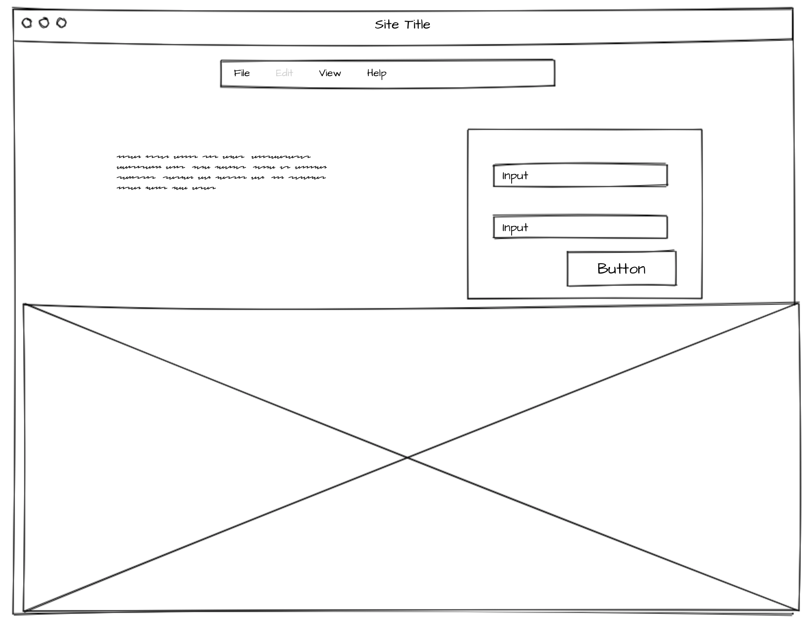
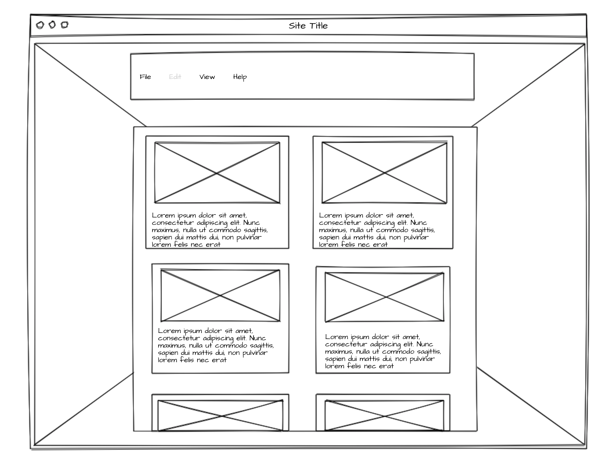
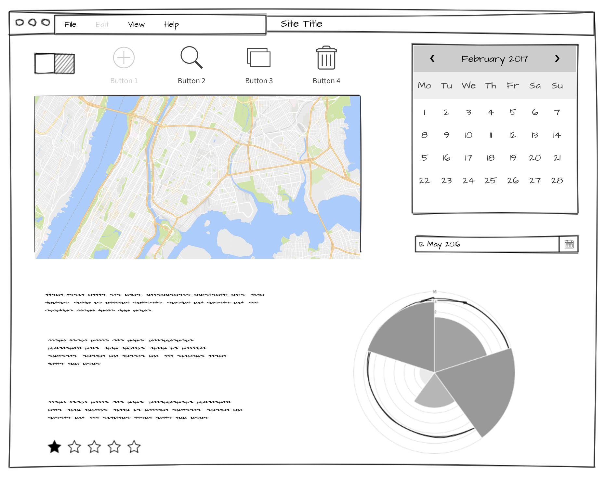

# Project 2

## The Rescue Repository

This is an app that is here to fix your pet search problems. No longer will you have to go from link to link searching for your new dog, or cat. Your one-stop shop for finding a shelter that fits your needs is now here. We are called the Rescue Repository and our focus is connecting you with your new best friend. Create an account to log in, and hear from other users about their experience with different shelters. View ratings and testimonials to help you better make your decision. Find locations near you that help you plan trips to meet and visit with your future pets. With the Rescue Repository the uncertainty of finding a good, well-mannered pet can fall by the wayside. Create a free account today and start searching!

## Resources

trello board: https://trello.com/b/AzjDHVUh/proj2

## Technology

The Rescue Repository is an app that is hosted on Heroku and uses node.js for the server. Mongo is used for the database with Mongoose.js communicating between the server and the database. The routing is done using Express.js. The app pulls in information using the Yelp-business API and organizes the information in an easy-to-use system, which is styled with the aid of Bootstrap. EJS renders files on the front end. Code stored on GitHub. You're pet is out there, just keep searching!

## Wireframes

Log-In Page:

Home-Page:

Shelter-Page:

## Goals and Objectives

This is an app that will connect you to local shelters and will give you an inventory of who might be housed there at the time, when that particular animal was brought in, and how long they have been in the shelter. People will be able to shop around from the comfort of their own home to get a good idea of what kind of dogs and cats are out there and how they can go about connecting with them. Visits can often be stressful and not everyone has the time in their day to visit with every animal. With the Rescue Repo we will show you all kinds of animals for you to easily search through, in order to expedite the amount of time you spend at the shelter. Having a few animals in particular in mind BEFORE visiting the shelter can provide some direction and incentive to your pet search. View images and descriptions before you even get out the door. Our aim is to improve your quality of life by connecting you with your perfect pet!

